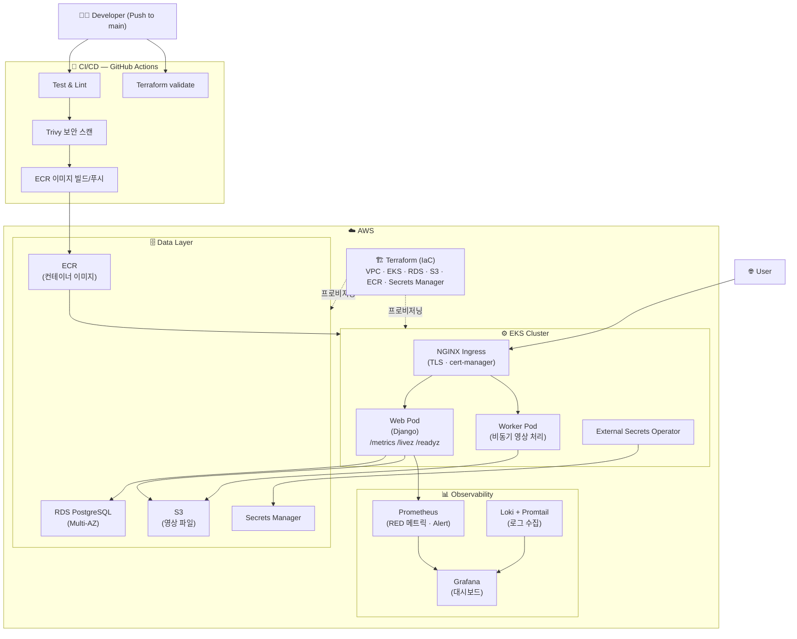

# Newnetflix

`kind` 기반 로컬 Kubernetes에서 Django 서비스를 운영하고, PostgreSQL HA(`repmgr + pgpool`) failover를 반복 검증하는 프로젝트입니다.

## 현재 구성
- App: `web`, `worker`, `nginx`
- DB HA: `postgres-ha-0`, `postgres-ha-1`, `postgres-ha-2` (P1 + S2)
- DB Proxy: `postgres-proxy` (`Service: postgres`)
- Monitoring: Prometheus + Grafana + `postgres-exporter`
- Fencing: `postgres-fencer` (split-brain 자동 감지/격리)

## 아키텍처



## 실행 방법

### 1) Docker Compose
```bash
cp .env.example .env
docker compose up --build -d
```

### 2) Local Kubernetes (kind)
```bash
./tools/kind.exe create cluster --name newnetflix-local
docker build --platform linux/amd64 --provenance=false -f docker/backend.Dockerfile -t newnetflix:local .
./tools/kind.exe load docker-image newnetflix:local --name newnetflix-local
kubectl apply -k k8s/local-ha
kubectl apply -k k8s/monitoring
kubectl apply -k k8s/observability
```

```bash
kubectl delete -k k8s/observability
kubectl delete -k k8s/monitoring
kubectl delete -k k8s/local-ha
./tools/kind.exe delete cluster --name newnetflix-local
```

## HA Drill 자동 검증
```bash
python scripts/ha_drill.py --iterations 10
```

빠른 확인:
```bash
python scripts/ha_drill.py --fast --iterations 3 --scenarios standby_recovery --poll-interval-seconds 5
```

## 측정 산출물
- 1차: `docs/ha-drill-runs-1st.csv`, `docs/ha-drill-summary-1st.json`
- 2차: `docs/ha-drill-runs-2nd.csv`, `docs/ha-drill-summary-2nd.json`
- 3차: `docs/ha-drill-runs-3rd.csv`, `docs/ha-drill-summary-3rd.json`
- 4차: `docs/ha-drill-runs-4th.csv`, `docs/ha-drill-summary-4th.json`
- 5차: `docs/ha-drill-runs-5th.csv`, `docs/ha-drill-summary-5th.json`
- 6차: `docs/ha-drill-runs-6th.csv`, `docs/ha-drill-summary-6th.json`
- 7차: `docs/ha-drill-runs-7th.csv`, `docs/ha-drill-summary-7th.json`
- 8차: `docs/ha-drill-runs-8th.csv`, `docs/ha-drill-summary-8th.json`
- 9차: `docs/ha-drill-runs-9th.csv`, `docs/ha-drill-summary-9th.json`
- 10차: `docs/ha-drill-runs-10th.csv`, `docs/ha-drill-summary-10th.json`

## 성공 기준과 용어 정의

### `core_success` (핵심 성공)
아래 핵심 안정성 조건을 만족하면 성공으로 계산합니다.
- split-brain 없음 (`primary == 1`)
- 승격/재조인 완료
- 데이터 무결성 OK
- 역할 수렴(P1+S2) OK
- pgpool 복구 시간 임계 내

### `extended_success` (확장 성공, 인스텐드)
`core_success`를 만족한 상태에서 운영 품질 조건까지 만족한 경우입니다.
- 알람이 정상 발생/해제됨 (`alert_cleared_after = true`)
- `/readyz` 5xx가 0

### 기준
- 기본은 5회 반복(빠른 개선 루프)
- 성공률이 안정적으로 올라가면 10회로 확장
- `RTO`, `재조인`, `pgpool 복구`, `/readyz`, 알람 해제 지연을 함께 기록

## 성공/실패 판정표
실패코드는 회차별 원인 분리를 위해 `fail_codes`에 기록합니다.

| 코드 | 의미 | 분류 |
|---|---|---|
| `FAIL_SPLIT_BRAIN` | 전이 구간 또는 종료 시점에 primary 경합 발생 | 핵심 실패 |
| `FAIL_NO_PROMOTION` | 지정 시간 내 승격 확인 실패 | 핵심 실패 |
| `FAIL_REJOIN_TIMEOUT` | 재조인 지연/실패 | 핵심 실패 |
| `FAIL_INTEGRITY` | marker/txid 무결성 검증 실패 | 핵심 실패 |
| `FAIL_ROLE_NOT_CONVERGED` | 종료 시 역할 상태(P1+S2) 미수렴 | 핵심 실패 |
| `FAIL_PGPOOL_RECOVERY_TIMEOUT` | pgpool 경유 쿼리 복구 시간 초과 | 확장 실패 |
| `FAIL_ALERT_UNCLEARED` | 장애 후 알람 정상 해제 실패 | 확장 실패 |
| `FAIL_READYZ_5XX` | drill 구간 `/readyz` 5xx 발생 | 확장 실패 |
| `FAIL_EXCEPTION` | 실행 예외 발생 | 실행 실패 |

## 운영 범위 분리
면접/리뷰 시 혼동을 줄이기 위해, 현재 저장소의 검증 범위와 클라우드 운영 가정 범위를 분리합니다.

| 구분 | 현재 저장소에서 검증한 범위 | 클라우드 운영 가정 범위 |
|---|---|---|
| 인프라 | `kind` 단일 로컬 클러스터 | EKS 멀티 AZ 클러스터 |
| DB HA | `repmgr + pgpool + fencer` | 관리형 DB(RDS Multi-AZ) 또는 Patroni+DCS+STONITH |
| 관측 | Prometheus/Grafana, exporter 기반 알람 | Alertmanager 연동, 온콜 체계, 티켓/콜백 자동화 |
| DR | failover drill 중심 | 백업/복구(PITR), 리전 단위 DR 리허설 |

## 실험 종료 기준(고정)
아래 기준을 만족해야 “안정화 완료”로 판단합니다.

- `primary_failover` 10회 기준 `core_success_rate >= 0.9`
- `primary_failover` 10회 기준 `extended_success_rate >= 0.8`
- `split_brain_count = 0`
- `RTO(p95) <= 35s`
- `pgpool_recovery_seconds(p95) <= 60s`
- `alert_uncleared_count = 0`

## 사용자 영향 지표 추적
DB 복구와 함께 사용자 체감 영향을 같이 기록합니다.

| 지표 | 수집 방법 | 목표 |
|---|---|---|
| `/readyz` 5xx 합계 | `readyz_5xx_count` 누적 | 0 |
| `/readyz` 지연 p95 | `readyz_p95_ms` | 100ms 이하(로컬 기준) |
| 업로드 성공률 | 업로드 API 성공/실패 카운트 | 99% 이상 |
| API 5xx 비율 | Prometheus `myflix_http_requests_total` | 1% 미만 |

## 현재 한계와 보완 계획
- 한계 1: split-brain이 회차에 따라 재발함.
- 보완 1: fencing hold-down/쿨다운과 승격 판정 윈도우를 함께 튜닝해 경계조건을 축소.

- 한계 2: `extended_success`가 `core_success` 대비 낮음.
- 보완 2: alert 해제 조건, pgpool backend health-check, `/readyz` 민감도 분리 튜닝.

- 한계 3: DB 중심 검증 대비 사용자 체감 지표 연결이 약함.
- 보완 3: 업로드 성공률, API 5xx, 지연시간 p95를 drill 결과와 함께 추적.

### 단계 전환 기준
- 5회 실험 단계: 튜닝/가설 검증 단계. 파라미터 변경 후 빠른 회귀 확인에 사용.
- 10회 실험 단계: 안정성 검증 단계. 아래를 만족하면 10회로 전환.
- 전환 조건: 최근 5회에서 `core_success_rate >= 0.8`, `split_brain_count = 0`, 치명 실패코드(`FAIL_SPLIT_BRAIN`, `FAIL_NO_PROMOTION`) 미발생.

## 1~10차 결과 요약

| 회차 | primary 성공률 | standby 성공률 | split-brain(primary) | 비고 |
|---|---:|---:|---:|---|
| 1차 | 60% (6/10) | 0% (0/10) | 2 | 초기 기준 |
| 2차 | 40% (4/10) | 0% (0/10) | 3 | 기준 강화 후 하락 |
| 3차 | 90% (9/10) | 0% (0/10) | 0 | 감지/펜싱 반영 |
| 4차 | 50% (5/10) | 100% (10/10) | 2 | 재생성 판정 반영 |
| 5차 | 20% (1/5) | 80% (4/5) | 1 | 5회 단축 실험 |
| 6차 | core 100% (5/5), ext 0% (0/5) | core/ext 100% (5/5) | 0 | primary의 운영품질 지표 미충족 |
| 7차 | core 80% (8/10), ext 20% (2/10) | core 100% (10/10), ext 90% (9/10) | 2 | primary 구간 변동성 재확인 |
| 8차 | core 60% (3/5), ext 0% (0/5) | core/ext 100% (5/5) | 2 | 튜닝 후 재측정(5회) |
| 9차 | core 80% (4/5), ext 0% (0/5) | core 100% (5/5), ext 80% (4/5) | 1 | split-brain/pgpool 지표 일부 개선 |
| 10차 | core 100% (5/5), ext 0% (0/5) | core 100% (5/5), ext 80% (4/5) | 0 | primary 안정화(핵심 지표 달성) |

### 1차
- 문제 1: Failover 성공/실패의 기준이 느슨해 원인 분리가 어려움.
- 문제 2: standby 복구 실패(0%)의 직접 원인(재조인/역할수렴/검증로직)이 분리 기록되지 않음.
- 관찰: primary 60%, standby 0%, split-brain/무결성 이슈 동반.
- 가설: 단순 승격만으로는 안정화가 부족하며, 재조인/역할수렴 검증이 필요.
- 다음 조치: split-brain 판정과 무결성 검증을 강화.

### 2차
- 문제 1: split-brain 빈도 증가(3회)에도 fencing/hold-down이 없어 다중 승격 경합을 제어하지 못함.
- 문제 2: 장애 감지 후 “승격 완료”와 “서비스 정상화”를 같은 성공으로 취급해 해석이 왜곡됨.
- 관찰: primary 40%, standby 0%, split-brain 빈도 증가.
- 가설: 장애 직후 다중 승격 경합이 발생하고 fencing 부재가 치명적.
- 다음 조치: fencing 및 감지 로직 도입.

### 3차
- 문제 1: primary는 개선됐지만 standby가 계속 0%여서, 재생성 Pod의 역할 고정/재조인 경로가 미완성.
- 문제 2: “최종 상태”만 보고 중간 전이(경합/지연)를 놓치는 관측 공백 존재.
- 관찰: primary 90%, split-brain 0으로 개선, standby는 여전히 0%.
- 가설: primary 승격은 안정화되지만 standby 재생성/재조인 수렴 판정이 불충분.
- 다음 조치: 재생성 Pod 기준(UID/개수/역할) 검증 추가.

### 4차
- 문제 1: standby는 안정화됐지만 primary 경로에서 postcheck 기준과 운영품질 지표가 충돌.
- 문제 2: pgpool 복구 지연, alert 해제 지연이 사용자 체감 장애를 길게 만듦.
- 관찰: primary 50%, standby 100%.
- 가설: standby 경로는 안정화되었고, primary 경로는 postcheck/운영품질 지표(알람 해제, readyz, pgpool)가 병목.
- 다음 조치: primary 검증을 단계별로 분해하고 병목 시간을 계측.

### 5차
- 문제 1: 5회 단축 실험에서 타이밍 민감도가 커져 결과 변동성 확대(primary 20%).
- 문제 2: 감지 주기/대기 시간/타임아웃 파라미터가 환경 부하 변화에 취약.
- 관찰: 5회 단축 실험에서 primary 20%, standby 80%로 변동성 확대.
- 가설: 빠른 반복 실험에서 타이밍 민감도(감지 주기/수렴 대기)가 성공률에 직접 영향.
- 다음 조치: 감지/폴링 주기와 검증 타임아웃 재튜닝.

## 6차 시간표(평균)
어디에서 시간이 오래 걸리는지 알기 위해 타임라인도 추가했고, 수집 항목은 `precheck`, `failure_action`, `recovery_wait`, `verification`, `wall`입니다.

| 시나리오 | precheck | failure_action | recovery_wait | verification | 총 소요(wall) |
|---|---:|---:|---:|---:|---:|
| primary_failover | 3.00s | 25.12s | 60.17s | 82.01s | 170.29s |
| standby_recovery | 3.05s | 120.85s | 1.15s | 4.44s | 129.48s |

### 6차
- 문제 1: core는 100%인데 extended는 0%로, “DB 승격 성공”과 “운영 품질 성공”의 괴리가 큼.
- 문제 2: primary 구간에서 `FAIL_ALERT_UNCLEARED`, 일부 `/readyz` 5xx, pgpool 수렴 지연이 상시 잔존.
- 관찰: primary core 100%(5/5)지만 extended 0%(0/5), standby core/ext 100%(5/5).
- 가설: DB 자체 failover는 성공했으나 alert 해제 지연, `/readyz` 5xx, pgpool 복구 지연이 운영품질 실패를 유발.
- 다음 조치: core/extended를 분리 운영하고, fencer/pgpool/alert 해제 구간 집중 튜닝 후 7차 진행.


## 7차 시간표(평균)
6차와 동일하게 `precheck`, `failure_action`, `recovery_wait`, `verification`, `wall`을 분리 계측했습니다.

| 시나리오 | precheck | failure_action | recovery_wait | verification | 총 소요(wall) |
|---|---:|---:|---:|---:|---:|
| primary_failover | 3.02s | 25.59s | 92.26s | 31.73s | 152.59s |
| standby_recovery | 3.73s | 120.78s | 1.23s | 4.46s | 130.20s |

### 7차
- 문제 1: split-brain이 다시 2회 발생해 fencing과 승격 판정 윈도우의 경계조건 문제가 재노출됨.
- 문제 2: `FAIL_PGPOOL_RECOVERY_TIMEOUT`(2회), `FAIL_ALERT_UNCLEARED`(7회)로 `extended_success` 성공률이 낮게 유지됨.
- 관찰: primary는 `core_success_rate=0.8`까지 회복됐지만 `extended_success_rate=0.2`에 머물렀고, 주요 실패코드는 `FAIL_ALERT_UNCLEARED(7)`, `FAIL_READYZ_5XX(5)`, `FAIL_PGPOOL_RECOVERY_TIMEOUT(2)`, `FAIL_SPLIT_BRAIN(2)`였음.
- 가설: DB 승격 자체(RTO 평균 23.71s)는 비교적 안정적이지만, 승격 이후 구간의 alert 해제 지연과 pgpool 백엔드 수렴 지연이 운영 품질 실패를 유발함.
- 다음 조치: fencer hold-down/쿨다운, pgpool backend health-check, alert 해제 기준을 함께 튜닝해 다음 차수에서 `extended_success` 개선 여부를 검증.

## 8차 시간표(평균)
7차와 동일하게 `precheck`, `failure_action`, `recovery_wait`, `verification`, `wall`을 분리 계측합니다.

| 시나리오 | precheck | failure_action | recovery_wait | verification | 총 소요(wall) |
|---|---:|---:|---:|---:|---:|
| primary_failover | 9.79s | 36.45s | 186.55s | 44.01s | 276.80s |
| standby_recovery | 3.13s | 120.83s | 1.17s | 4.32s | 129.45s |

### 8차
- 문제 1: `split_brain_count=2`가 재발했고, primary 경로의 안정화가 여전히 불충분함.
- 문제 2: `extended_success_rate=0.0`으로 운영품질 지표(alert/readyz/pgpool)가 동시 충족되지 않음.
- 관찰: primary는 core 60%(3/5), ext 0%(0/5)였고 실패코드는 `FAIL_READYZ_5XX(4)`, `FAIL_SPLIT_BRAIN(2)`, `FAIL_PGPOOL_RECOVERY_TIMEOUT(2)`, `FAIL_ALERT_UNCLEARED(2)`로 집계됨. standby는 core/ext 100%(5/5)로 안정적이었음.
- 가설: 7차 대비 튜닝으로 standby 경로는 안정화되었지만, primary 구간은 승격 직후 수렴 타이밍(roles/pgpool/alert) 경합이 남아 split-brain과 확장 실패를 유발함.
- 다음 조치: primary_failover만 분리해 5회 재측정하고, fencer 기준(leader 고정/fence 윈도우)과 pgpool 복구 대기 기준을 단계적으로 조정해 `split_brain=0`과 `extended_success` 개선 여부를 확인.

## 9차 시간표(평균)
8차와 동일하게 `precheck`, `failure_action`, `recovery_wait`, `verification`, `wall`을 분리 계측합니다.

| 시나리오 | precheck | failure_action | recovery_wait | verification | 총 소요(wall) |
|---|---:|---:|---:|---:|---:|
| primary_failover | 5.35s | 23.24s | 128.84s | 29.96s | 187.40s |
| standby_recovery | 2.97s | 121.19s | 1.12s | 4.25s | 129.54s |

### 9차
- 문제 1: primary에서 `extended_success=0`이 지속되어 운영품질 수렴이 미완성 상태임.
- 문제 2: split-brain이 1회 남아 있어 fencing/승격 경계조건 이슈가 완전히 제거되지 않음.
- 관찰: primary는 core 80%(4/5)로 개선됐고 실패코드는 `FAIL_READYZ_5XX(5)`, `FAIL_SPLIT_BRAIN(1)`이었음. standby는 core 100%(5/5), ext 80%(4/5)로 유지됨.
- 가설: split-brain과 pgpool timeout은 줄었지만, `/readyz` 5xx가 extended를 계속 막고 있어 애플리케이션 레벨 복구 경로(웹 readiness/DB 재연결) 튜닝이 다음 병목임.
- 다음 조치: web readiness probe 임계치와 DB 재시도 정책을 조정하고, primary_failover 5회 재측정으로 `FAIL_READYZ_5XX` 감소 여부를 검증.

## 10차 시간표(평균)
9차와 동일하게 `precheck`, `failure_action`, `recovery_wait`, `verification`, `wall`을 분리 계측합니다.

| 시나리오 | precheck | failure_action | recovery_wait | verification | 총 소요(wall) |
|---|---:|---:|---:|---:|---:|
| primary_failover | 2.98s | 26.25s | 128.73s | 64.81s | 222.78s |
| standby_recovery | 3.02s | 120.86s | 1.12s | 4.22s | 129.23s |

### 10차
- 문제 1: primary `extended_success=0`이 지속되어 운영품질 지표가 핵심 안정성 대비 뒤처짐.
- 문제 2: `FAIL_READYZ_5XX`가 primary 전 회차(5/5)에서 발생해 확장 성공을 막음.
- 관찰: primary는 core 100%(5/5), split-brain 0회로 안정화됐고 standby는 core 100%(5/5), ext 80%(4/5)를 유지함.
- 가설: fencing/승격 수렴 문제는 크게 완화됐으나, app readiness 경로의 일시적인 5xx가 `extended_success`의 단일 병목으로 남음.
- 다음 조치: `/readyz` 기준을 DB failover 전환 구간과 분리해 튜닝하고, 10회 확장 실험으로 `extended_success` 추세를 재검증.

### 7차 대비 변경점(8차 적용)
- `k8s/local-ha/fencer.yaml`: `CHECK_INTERVAL_SECONDS=3`, `FENCE_COOLDOWN_SECONDS=20`, `MAX_FENCES_PER_WINDOW=5`로 조정.
- `k8s/local-ha/pgpool.yaml`: health-check 관련 환경변수(`PGPOOL_HEALTH_CHECK_*`, `PGPOOL_SR_CHECK_PERIOD`) 추가.
- `scripts/ha_drill.py`: alert 해제 판정을 즉시 1회 체크에서 grace polling으로 변경, primary 시나리오의 pgpool 복구 측정 시작점을 수렴 이후 시점으로 조정.

## 재현 명령(환경구축 -> 실험 -> 결과확인)
```bash
./tools/kind.exe create cluster --name newnetflix-local
docker build --platform linux/amd64 --provenance=false -f docker/backend.Dockerfile -t newnetflix:local .
./tools/kind.exe load docker-image newnetflix:local --name newnetflix-local
kubectl apply -k k8s/local-ha
kubectl apply -k k8s/monitoring
kubectl apply -k k8s/observability
python scripts/ha_drill.py --iterations 5
python scripts/ha_drill.py --iterations 10
```

## 참고
- 실험 세부 로그/근거: `docs/ha-drill-runs-*.csv`, `docs/ha-drill-summary-*.json`
- 장애 대응 문서: `docs/runbook.md`, `docs/dr.md`, `docs/incident-report.md`
