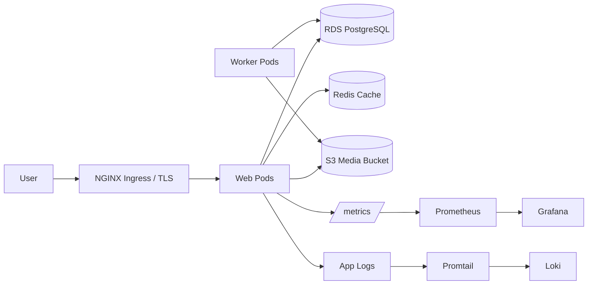

# Architecture (MyFlix)

## Key Points
- Public ingress is HTTPS-only with cert-manager managed certificates.
- App runs on EKS with HPA, PDB, and NetworkPolicy enabled.
- Secrets are delivered via External Secrets + AWS Secrets Manager (IRSA).
- Observability includes RED metrics, dashboards, and log aggregation.
